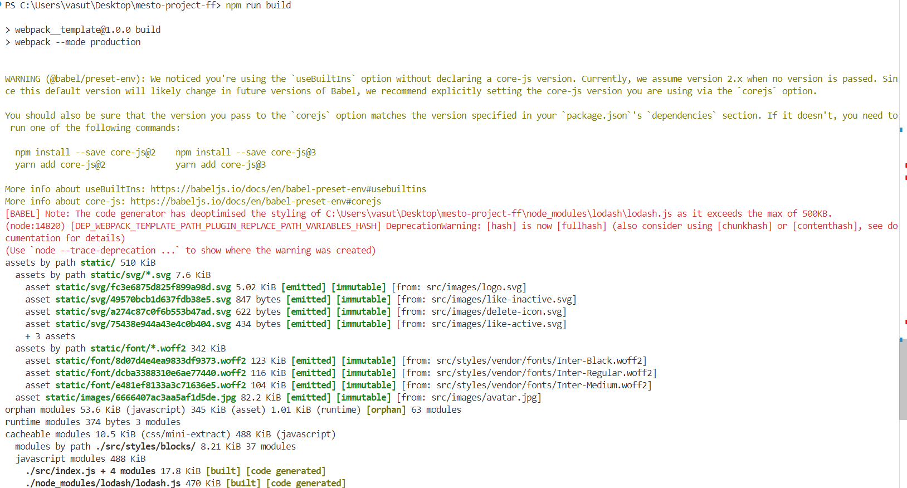

# Проектная работа Mesto

Для запуска проекта: npm run start

Для запуска сборки проекта: npm run build 

Для yстановки зависимости: npm install

Как Bыглядет сборка проекта:

Как Bыглядет запyск проекта:

https://github.com/Aodhogane/mesto-project-ff/tree/main