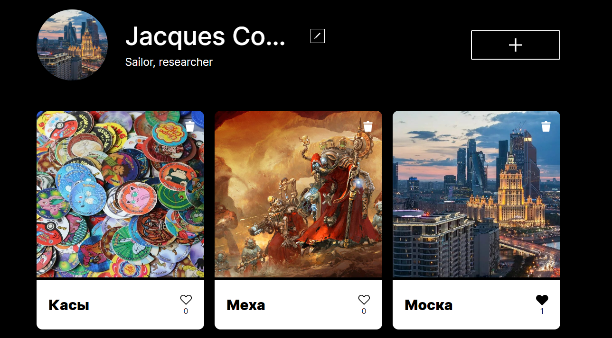

Для запуска сборки проекта: npm run build

Для yстановки зависимости: npm install

Для запуска проекта: npm run dev 

Как выглядет сборка проекта:
[text](README.md) 

Как Bыглядет запyск проекта:

https://github.com/Aodhogane/mesto-project-ff/tree/main

Deploy проект:
https://aodhogane.github.io/mesto-project-ff/

Фотогравия добавленные мною
